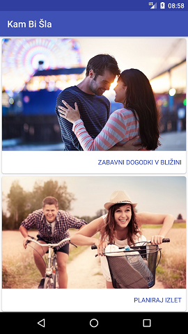

# Kam Bi Šla (Where To Go)

This is an Android project created for a business idea that didn't get enough traction for the project to be completed. As a result some features of the app are mock-ups. The idea was for the app user to get information about interesting events close to his/her current location, and to create a plan full of fun activities for the time he/she has available. It was meant for people that find themselves in the city with a few hours of free time to kill. The app is in Slovenian.

## Showcase screenshots

## Getting Started

1. Clone or download the project from this page.
2. Import the project into Android Studio.

## Authors

* **Matic Pajnič** 
